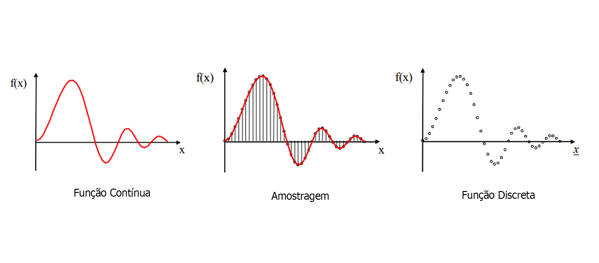
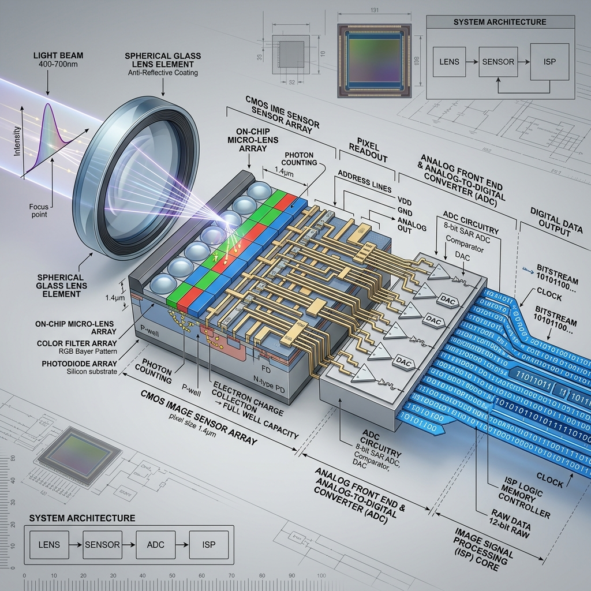
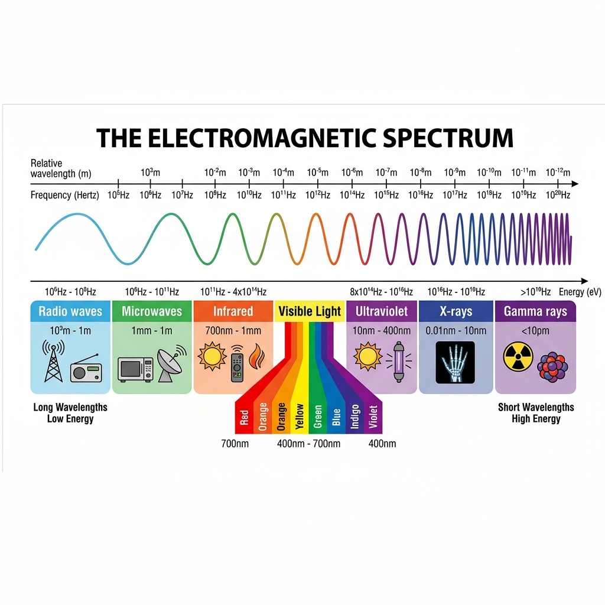
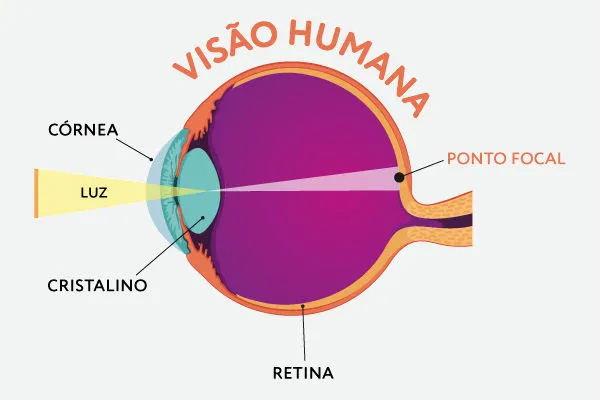
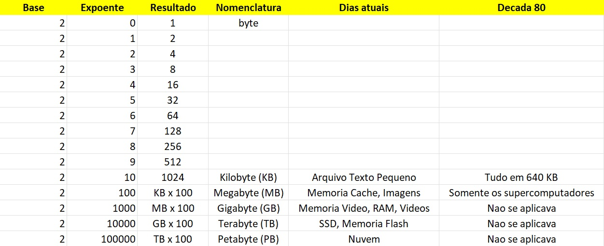
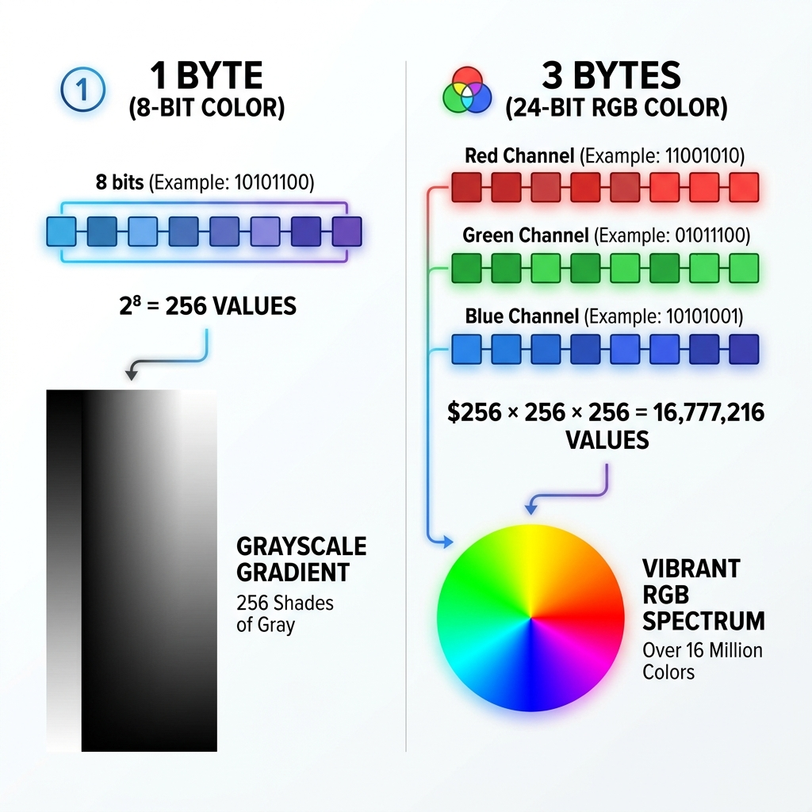
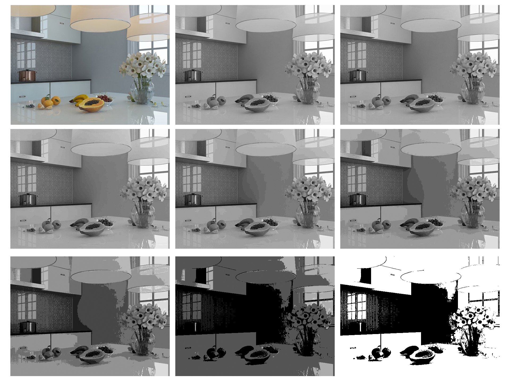
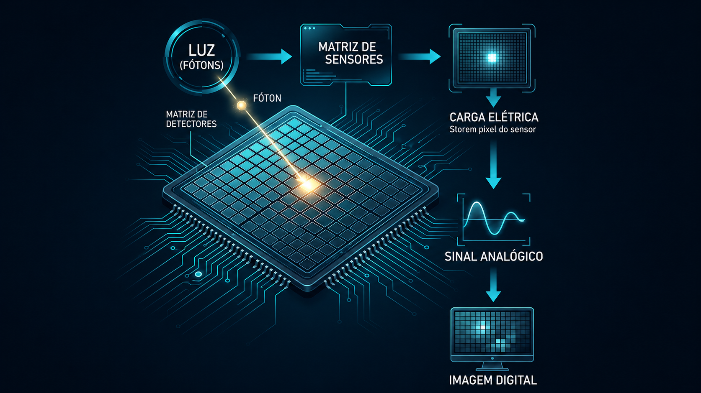

# Unidade 2 — Formação da Imagem Digital
PROF. SAULO SANTOS

## 1. Apresentação da unidade

A fotografia digital transforma luz em informação. Diferentemente do processo analógico, em que a imagem depende de suporte químico, a fotografia digital converte a cena luminosa em dados eletrônicos que são processados, armazenados e exibidos em formato digital.

Nesta unidade, o estudante irá compreender como a imagem digital é formada, quais elementos compõem sua estrutura e de que maneira resolução, cor, profundidade e formato de arquivo interferem na qualidade e no uso final da fotografia.

---

## 2. Objetivos da unidade

Ao final desta unidade, o estudante deverá ser capaz de:

- Explicar como a imagem digital é formada.
- Compreender o papel do sensor na captura da luz.
- Identificar a função dos pixels na construção da imagem.
- Distinguir resolução, tamanho e qualidade de arquivo.
- Reconhecer os principais modos de cor.
- Entender o conceito de profundidade de cor.
- Diferenciar formatos de arquivo fotográfico.
- Aplicar noções básicas de armazenamento e organização de imagens.

---

## 3. Introdução

### 3.1 Som, Imagem e Vídeo

Som, imagem e vídeo são três elementos distintos que, apesar de frequentemente estarem interligados, possuem características e representações diferentes.

O som é um sinal unidimensional, cuja variação ocorre ao longo do tempo, tanto em frequência quanto em amplitude. Um exemplo clássico de som é a música, onde as oscilações dessas propriedades geram as diferentes tonalidades e intensidades que percebemos. 

Por outro lado, a imagem é um sinal bidimensional que pode ser representado em um sistema de coordenadas cartesianas, onde cada ponto da imagem possui uma posição definida por dois eixos, geralmente o eixo horizontal (x) e o eixo vertical (y). Quando observamos a tela de um computador, por exemplo, estamos visualizando uma imagem composta por pixels organizados de acordo com esse sistema.

O vídeo, por sua vez, combina as dimensões de tempo e espaço, representando uma sequência de imagens (quadros) exibidas em rápida sucessão, acompanhadas ou não de som, criando a ilusão de movimento. Ao falarmos, emitimos sons que possuem a característica de serem contínuos, ou seja, variam de forma ininterrupta ao longo do tempo. Por essa razão, os sons são representados por funções contínuas, cujas propriedades, como frequência e amplitude, se modificam de maneira
contínua no domínio temporal.

### 3.2. Sinal e Imagem Digitais: Discretização

Quando falamos, emitimos sons e esses sons possuem a característica de serem contínuos. Por isso, são representados por funções contínuas. Um som possui frequência e amplitude que variam ao longo do tempo.

Quando convertemos um som (sinal contínuo) para um meio digital, capturamos pequenas amostras deste sinal contínuo. Este processo denomina-se amostragem e pode ser representado computacionalmente por um array unidimensional. O resultado é chamado de sinal discreto.

Já uma imagem, quando por exemplo olhamos fixamente para um objeto numa sala, é dita um sinal bidimensional contínuo. 

Assim como o som, esse sinal bidimensional contínuo também pode ser representado digitalmente por meio de um array bidimensional. O processo é o mesmo da discretização do som – armazena-se uma parcela do sinal bidimensional contínuo.

No caso dos vídeos, trata-se de um “empilhamento” de imagens num instante de tempo. Por exemplo, para se obter um segundo de vídeo, há a necessidade de no mínimo 24 imagens “empilhadas”. 

---

## 4. Fluxo de formação da imagem

O processo básico de formação da imagem digital pode ser entendido da seguinte forma:

Cena → Luz → Lente/Objetiva → Sensor → Processamento → Arquivo

A imagem digital é resultado da conversão da luz em dados. Quando a luz atravessa a lente e alcança o sensor da câmera, essa informação é convertida em sinais elétricos, que posteriormente são processados e transformados em um arquivo visual.

Esse processo envolve diversos elementos técnicos, como sensor, resolução, pixels, modo de cor, profundidade de bits e formato de arquivo. Conhecer esses conceitos é fundamental para compreender a qualidade da imagem, seu uso em edição e sua adequação para diferentes finalidades, como tela, impressão ou arquivamento.

### 4.1 Luz e o Espectro Eletromagnético

A luz que forma a fotografia é apenas uma pequena parte de um fenômeno muito mais amplo: o **espectro eletromagnético**. Como ilustrado na imagem, o espectro abrange diferentes tipos de ondas eletromagnéticas, que variam de acordo com a sua frequência e o seu comprimento de onda.

O espectro é dividido basicamente em duas grandes categorias:
- **Radiação Não-Ionizante:** Possui frequências menores e ondas mais longas. Inclui as Ondas Baixas (redes elétricas), Rádio (TV, rádio, Wi-Fi), Microondas e o Infravermelho (usado em controles remotos).
- **Radiação Ionizante:** Possui altíssima frequência e ondas mais curtas, tendo energia suficiente para interagir e alterar a matéria. Inclui a radiação Ultravioleta (emitida pelo Sol), Raios-X (uso médico) e Raios Gama.

Entre essas duas extremidades encontra-se a **Luz Visível**, uma faixa bastante estreita compreendida entre os comprimentos de onda de 700nm a 400nm. É exatamente essa pequena fatia do espectro — contendo as cores do arco-íris, do vermelho ao violeta — que os nossos olhos conseguem enxergar e que os sensores das câmeras são projetados para capturar.

### 4.2 Etapas do processo

- **Cena:** o objeto, pessoa ou ambiente a ser fotografado.
- **Luz:** a iluminação que incide sobre a cena.
- **Lente/objetiva:** direciona a luz para o sensor.
- **Sensor:** converte a luz em sinal eletrônico.
- **Processamento:** interpreta os dados capturados.
- **Arquivo:** imagem final salva em um formato específico.

### 4.3 Importância do fluxo

Cada etapa interfere no resultado final. Uma boa fotografia não depende apenas da câmera, mas também da luz, da lente, da configuração do sensor e do modo como a imagem será armazenada.

### 4.4 Visão Humana

O funcionamento das câmeras digitais foi fortemente inspirado pela biologia da nossa própria visão. No olho humano, a luz atravessa a córnea e o cristalino (que funcionam de maneira análoga à lente/objetiva da câmera) e é projetada no fundo do globo ocular, em uma camada celular chamada **retina** (que atua exatamente como o sensor fotográfico).

A retina é revestida por milhões de células fotorreceptoras especializadas, cuja função é transformar a luz recebida em sinais elétricos. Existem dois tipos principais dessas células:
- **Bastonetes:** São extremamente sensíveis à luz e nos permitem enxergar em ambientes escuros (visão noturna). No entanto, eles captam apenas a intensidade luminosa, sem distinguir cores (gerando uma visão em tons de cinza).
- **Cones:** São os responsáveis pela nossa visão de alta resolução e pela percepção das cores. Eles funcionam melhor em ambientes bem iluminados e dividem-se em três tipos, sensíveis principalmente ao Vermelho, Verde e Azul — a inspiração orgânica direta para o modelo RGB das telas e câmeras digitais.

Uma vez que a luz é convertida em impulsos elétricos pelos cones e bastonetes, esses sinais viajam através do **nervo óptico** (que funciona como o cabo de transferência de dados) em direção ao cérebro (o processador). É no córtex visual que essa torrente de sinais elétricos é finalmente processada, interpretada e transformada na imagem consciente que nós visualizamos.

 
Fonte: Brasil Escola

---

## 5. Pixel

### 5.1 Conceito

O pixel é a menor unidade de informação de uma imagem digital. Ele representa um ponto da imagem e, em conjunto com milhares ou milhões de outros pixels, forma a fotografia completa.

### 5.2 Formação da imagem

Quanto maior o número de pixels, maior tende a ser a possibilidade de detalhamento. No entanto, a qualidade da imagem não depende apenas da quantidade de pixels, mas também da exposição, do sensor, da lente e do processamento.

### 5.3 Exemplo prático

Uma imagem com resolução de 1920 × 1080 possui 2.073.600 pixels no total. Isso significa que a fotografia contém mais de dois milhões de pontos de informação visual.

---

## 6. Byte

### 6.1 O que é um Bit e um Byte?

O **bit** (Binary Digit) é a menor unidade de informação em um computador, podendo assumir apenas os valores 0 ou 1. Um **byte** é um agrupamento de 8 bits. Essa estrutura é a base matemática que os processadores utilizam para armazenar e interpretar qualquer tipo de dado digital.

 

### 6.2 Importância na formação de caracteres e pixels

- **Caracteres (Texto):** Na computação clássica (como no padrão ASCII), cada letra, número ou pontuação digitado é representado por exatamente 1 byte (8 bits). Isso significa que cada caractere do teclado possui um código binário único.
- **Pixels (Imagem):** Na fotografia digital, a intensidade luminosa e a cor capturadas pelo sensor são quantificadas em bytes para compor cada pixel. Se um pixel usa 1 byte de profundidade, ele pode exibir 256 tons de cinza. Se usar 3 bytes (RGB), atinge mais de 16 milhões de cores. Portanto, o byte é a estrutura essencial que constrói tanto a informação textual quanto a visual.

---

## 7. Resolução

### 7.1 Conceito

Resolução é a quantidade de informação visual presente em uma imagem. Ela costuma ser expressa em largura e altura, como 1920 × 1080, 4000 × 3000 ou 6000 × 4000.

### 7.2 Resolução e uso da imagem

A resolução interfere diretamente em:

- Nitidez aparente.
- Possibilidade de ampliação.
- Qualidade de impressão.
- Peso do arquivo.
- Flexibilidade de edição.

### 7.3 Resolução e tamanho do arquivo

Imagens com resolução maior tendem a ocupar mais espaço de armazenamento. Isso é importante em fotografia profissional, onde arquivos grandes oferecem mais liberdade de tratamento, mas exigem mais memória e processamento.

### 7.4 Resolução de tela e de impressão

É importante não confundir resolução de imagem com o modo como ela será exibida.

- **Tela:** a imagem é vista em monitores, celulares e projetores.
- **Impressão:** a imagem é reproduzida em papel, exigindo critérios diferentes de definição.

### 7.5 Conceitos relacionados

- **PPI:** pixels por polegada, usado para relacionar imagem e impressão.
- **DPI:** pontos por polegada, termo mais associado ao processo de impressão.

---

## 8. Modo de cor

### 8.1 Conceito

Modo de cor é a forma como as cores são organizadas e representadas em uma imagem digital.

### 8.2 RGB

O modelo RGB é baseado nas cores vermelha, verde e azul. Ele é amplamente utilizado em telas, monitores, celulares, televisores e ambientes digitais em geral.

### 8.3 Por que a tela usa RGB?

A tela funciona pela emissão de luz. Como o sistema RGB é aditivo, ele combina luzes coloridas para criar a imagem percebida pelo observador.

### 8.4 Escala de cinza

A escala de cinza representa apenas tonalidades entre preto e branco, sem informação de cor. É usada em trabalhos específicos, análises visuais e imagens com intenção monocromática.

### 8.5 Atividade proposta

Abra uma mesma fotografia em RGB e em escala de cinza. Observe como a mudança do modo de cor altera a leitura da imagem.

### 8.6 Bits, Bytes e a Representação Digital da Cor

O computador armazena informações utilizando **bits** (que podem ser 0 ou 1). Um conjunto de 8 bits forma 1 **byte**. Essa base matemática é o que define como a cor é registrada em uma imagem digital:

- **Imagens Monocromáticas:** Podem ser representadas por um único byte por pixel. Como 1 byte possui 8 bits (2⁸), ele consegue registrar até 256 tonalidades distintas, que vão do preto absoluto ao branco puro, passando por diversas variações de cinza.
- **Imagens Coloridas:** O sistema padrão (RGB) utiliza 3 bytes por pixel, sendo um byte dedicado para cada canal de cor primária (Vermelho, Verde e Azul). Ao combinar esses canais (2²⁴), o sistema é capaz de gerar mais de 16 milhões de cores.

Essa mesma lógica é utilizada no desenvolvimento de páginas web. Quando você escreve um arquivo `style.css`, pode representar as cores usando a notação hexadecimal. Por exemplo, a propriedade `color: #ff0000;` representa a cor vermelha. Esse código mapeia exatamente os bytes do RGB, e dessa forma, todas as 16 milhões de possibilidades de cores podem ser expressadas no CSS.

### 8.7 Arquivos PNG e o Canal Alpha

A lógica dos bytes se expande ainda mais quando falamos de formatos específicos como o **PNG** (Portable Network Graphics). Enquanto imagens coloridas comuns (como JPEG) usam 3 bytes (RGB) por pixel, os arquivos PNG introduzem um **quarto byte**.

Esse 4º byte é conhecido como **Canal Alpha** e é o responsável exclusivo por armazenar informações de **transparência**. 
- **4 Bytes por Pixel:** Com 4 bytes no total (32 bits), o formato atinge a marca de 2³² possibilidades por pixel (mais de 4,2 bilhões de variações).
- Isso significa que as 16 milhões de cores do RGB são combinadas com 256 níveis diferentes de opacidade (do totalmente transparente ao totalmente opaco).

**Impacto no Design:**
Essa característica revolucionou o web design e a criação de interfaces. A possibilidade de utilizar a transparência com tamanha precisão permite recortar elementos gráficos, aplicar sombras suaves, inserir logotipos sem um fundo branco e criar layouts complexos em camadas. Sem a versatilidade desse 4º byte, composições gráficas avançadas sobrepondo diferentes imagens e cores seriam impossíveis no design digital.

---

## 9. Profundidade de cor

### 9.1 Conceito

Profundidade de cor é a quantidade de informação cromática que uma imagem pode representar. Ela está relacionada ao número de bits usados para codificar as cores.

### 9.2 Exemplos práticos

- 8 bits: representação mais limitada.
- 16 bits: maior quantidade de informação tonal.
- 24 bits: milhões de cores possíveis.

### 9.3 Relação com a qualidade

Quanto maior a profundidade de cor, maior a capacidade de representar variações suaves de tonalidade. Isso é especialmente útil em edição, tratamento e gradação de cor.

### 9.4 Vantagens e desvantagens

- **Vantagem:** mais fidelidade e melhor controle no pós-processamento.
- **Desvantagem:** arquivos maiores e maior exigência de armazenamento.

#### Análise de impacto no armazenamento (Exemplo prático)

Para compreender visualmente o impacto da profundidade de cor na desvantagem de armazenamento, vamos simular o tamanho de uma imagem com resolução **4K (3840 × 2160 pixels)**. Multiplicando a largura pela altura, descobrimos que essa imagem possui exatamente **8.294.400 pixels**. 

Se salvarmos essa imagem sem nenhuma compactação matemática (dados brutos ponto a ponto), o tamanho do arquivo será calculado multiplicando a quantidade de pixels pela quantidade de bytes (onde 8 bits = 1 byte):

- **8 bits (1 byte por pixel):** 
  8.294.400 pixels × 1 byte = 8.294.400 bytes (aproximadamente **8,3 MB**).
- **16 bits (2 bytes por pixel):** 
  8.294.400 pixels × 2 bytes = 16.588.800 bytes (aproximadamente **16,6 MB**).
- **24 bits (3 bytes por pixel, ex: RGB):** 
  8.294.400 pixels × 3 bytes = 24.883.200 bytes (aproximadamente **24,9 MB**).
- **32 bits (4 bytes por pixel, ex: RGBA com canal Alpha):** 
  8.294.400 pixels × 4 bytes = 33.177.600 bytes (aproximadamente **33,2 MB**).

A análise numérica comprova que cada canal adicional ou aumento de qualidade exigido na profundidade de cor impacta de forma direta e proporcional o peso do arquivo na memória.

### 9.5 Atividade proposta

Compare imagens salvas com diferentes profundidades de cor e observe o impacto no tamanho do arquivo e na qualidade de gradações.

### 9.6 Redução de Profundidade em Imagens Monocromáticas

Embora uma imagem monocromática padrão utilize 8 bits (1 byte) por pixel para formar os tradicionais 256 tons de cinza, é plenamente possível trabalhar com profundidades inferiores. O ato de remover bits diminui as combinações possíveis, criando transições mais duras entre as cores e arquivos ainda mais leves.

A redução numérica de possibilidades ocorre da seguinte forma matemática (potências de 2):
- **7 bits:** 128 tons de cinza.
- **6 bits:** 64 tons de cinza.
- **5 bits:** 32 tons de cinza.
- **4 bits:** 16 tons de cinza.
- **3 bits:** 8 tons de cinza.
- **2 bits:** 4 tons de cinza.
- **1 bit (Imagem Binária):** Ao restringir a informação do pixel a um único bit, as opções se reduzem a apenas duas: 0 (preto absoluto) e 1 (branco puro). Esse formato elimina totalmente a escala de cinza e é popularmente conhecido como imagem binária ou de alto-contraste. É um padrão histórico amplamente utilizado na digitalização de documentos de texto, códigos de barra e estilizações artísticas focadas em silhuetas geométricas.

A imagem abaixo possui diferentes profundidades de cor, permitindo a visualização das diferenças entre as profundidades de cor: 24 bits, 8 bits, 7 bits, 6 bits, 5 bits, 4 bits, 3 bits, 2 bits e 1 bit. 

*Atenção:* A imagem com 1 bit de profundidade é uma imagem binária, ou seja, possui apenas duas cores: preto e branco (2^1=2 tons de cinza).

Imagens com 2 tons de cinza possuem alguma aplicação prática? Discuta com seus colegas.

### 9.7 A relação entre Imagens Binárias e Aplicações Multimídia

A resposta para a discussão prática é afirmativa: existe uma associação direta e fundamental entre **imagens binárias (1 bit)** e a técnica de **silhuetas** em aplicações de multimídia. Na computação gráfica, no web design e na visão computacional, essa estrutura de 1 bit é a base matemática para o que chamamos de **Máscaras de Silhueta (Alpha Masks)** ou **Máscaras de Recorte**.

Veja como essa associação acontece na prática:

1. **Separação de Fundo (Chroma Key / Fundo Verde):** Quando um software remove o fundo verde de um vídeo, ele cria uma "silhueta" invisível do ator. Essa silhueta é estruturalmente uma imagem binária: os pixels onde o ator está viram `1` (visível/branco) e os pixels do fundo verde viram `0` (transparente/preto). 
2. **Hitboxes e Colisões (Jogos e Interatividade):** Em jogos 2D e interações na web, para o computador saber se o clique do mouse acertou um objeto irregular ou passou direto, ele utiliza uma silhueta binária. Se o clique cair em um pixel `1` da silhueta, houve colisão/interação; se cair no `0`, o clique é ignorado.
3. **Sensores de Movimento (Kinect e Realidade Aumentada):** Sensores que rastreiam o corpo humano criam continuamente "mapas binários" do ambiente. O corpo do usuário vira uma silhueta (pixels = 1) destacada do fundo da sala (pixels = 0), permitindo que o sistema saiba exatamente as coordenadas do usuário.
4. **Filtros de deteção de contorno:** Em processamento de imagens, algoritmos como o de Canny utilizam imagens binárias para deteção de contornos. 

Portanto, a imagem de 1 bit deixa de ser apenas uma "foto preta e branca de baixa qualidade" e se torna uma **ferramenta de controle** poderosíssima: ela diz ao software exatamente "onde o objeto existe" (1) e "onde ele não existe" (0).

---

## 10. Sensor de imagem

### 10.1 Conceito

O sensor é o componente da câmera responsável por captar a luz e transformá-la em sinal digital. Ele é um dos elementos mais importantes na formação da imagem.

### 10.2 Função do sensor

O sensor registra a luz que passa pela lente e converte essa informação em dados que serão processados pela câmera.

### 10.3 Tipos comuns de sensor: CCD e CMOS

CCD e CMOS são as duas principais tecnologias historicamente utilizadas na fabricação de sensores de imagem para câmeras digitais. Ambas transformam a luz que chega aos pixels em sinais elétricos, mas fazem isso com arquiteturas diferentes. 

Em ambos os sensores, temos uma matriz de fotodetectores. Quando um fóton atinge um pixel, ele gera uma quantidade de carga elétrica proporcional à quantidade de luz recebida:
**luz → carga elétrica → sinal → conversão A/D → imagem digital**

A grande diferença está em como essa carga é lida e convertida em informação digital.

#### CCD (Charge-Coupled Device)

No CCD, os pixels não possuem individualmente toda a eletrônica necessária para realizar a leitura. A carga acumulada em cada pixel é deslocada através da matriz (de pixel em pixel) até chegar a uma região de saída, onde é lida e enviada para o conversor analógico-digital (ADC).

*Características Históricas do CCD:*
- Excelente uniformidade entre pixels.
- Baixo ruído de leitura.
- Excelente reprodução tonal e alta sensibilidade.
*Essas vantagens fizeram do CCD, por muito tempo, a escolha principal para fotografia de alta qualidade, microscopia, astronomia e equipamentos científicos.*

#### CMOS (Complementary Metal-Oxide-Semiconductor)

No CMOS, cada pixel possui sua própria eletrônica de leitura acoplada (ou pelo menos parte dela). Isso permite uma arquitetura muito mais próxima da utilizada em circuitos integrados convencionais. Dessa forma, é possível integrar no próprio sensor amplificadores, conversores A/D, controle, processamento e circuitos de redução de ruído.

*Por que o CMOS acabou dominando o mercado?*
Em sensores modernos de altíssima resolução (como um sensor de 24 milhões de pixels, por exemplo), deslocar a carga pela matriz inteira como no CCD seria ineficiente. Como o CMOS explora uma **arquitetura paralela**, ele facilita atingir:
- Altas taxas de quadros e leitura rápida (vídeo 4K/8K).
- Autofocus rápido e processos em HDR.
- Baixo consumo de energia.

Além disso, por utilizar processos de fabricação muito relacionados à indústria de semicondutores padrão, o CMOS trouxe uma enorme vantagem econômica na produção em larga escala, tornando-se a tecnologia predominante hoje em dia.

#### Comparação Arquitetural (Evolução)

| Característica            | CCD                            | CMOS                           |
| ------------------------- | ------------------------------ | ------------------------------ |
| **Leitura**               | Carga é deslocada pela matriz  | Leitura individual/por regiões |
| **Eletrônica no pixel**   | Menor                          | Maior                          |
| **Consumo de energia**    | Geralmente maior               | Geralmente menor               |
| **Velocidade**            | Tradicionalmente menor         | Tradicionalmente maior         |
| **Integração no chip**    | Menor                          | Muito maior                    |
| **Custo de fabricação**   | Maior                          | Menor                          |
| **Uso atual**             | Nichos científicos/específicos | Predominante                   |

*(Nota: O ruído do CMOS, que antigamente era uma desvantagem em relação ao CCD, evoluiu enormemente nas gerações modernas, igualando ou superando a qualidade tradicional do CCD.)*

### 10.4 Importância do sensor

O sensor influencia:

- Qualidade da imagem.
- Resposta à luz.
- Comportamento em ambientes escuros.
- Ruído digital.
- Velocidade de processamento.

---

## 11. Memória e armazenamento

### 11.1 Conceito

Após a captura, a imagem precisa ser armazenada em um cartão de memória ou outro dispositivo de gravação.

### 11.2 Tipos comuns de cartão

- SD.
- SDHC.
- SDXC.

### 11.3 Boas práticas

- Manter cartões organizados.
- Fazer backup regularmente.
- Evitar remover o cartão durante gravação.
- Formatar o cartão corretamente na câmera.
- Proteger arquivos importantes contra perda ou corrupção.

### 11.4 Importância do armazenamento

Na fotografia digital, o armazenamento faz parte do fluxo de trabalho. Um sistema de memória inadequado pode comprometer a segurança dos arquivos e a continuidade da produção.

---

## 12. Formatos de arquivo

### 12.1 Conceito

Os formatos de arquivo determinam como a imagem será armazenada, editada, visualizada e compartilhada.

### 12.2 RAW

Formato que preserva grande quantidade de informação capturada pelo sensor. É ideal para edição e pós-produção, pois oferece maior flexibilidade de ajuste.

#### Características
- Maior quantidade de dados.
- Excelente para edição.
- Arquivos maiores.
- Requer software compatível.

### 12.3 JPEG

Formato comprimido e amplamente compatível. É muito usado para compartilhamento, publicação e uso cotidiano.

#### Características
- Menor tamanho de arquivo.
- Alta compatibilidade.
- Compressão com perda de dados.
- Boa praticidade para uso geral.

### 12.4 TIFF

Formato associado a trabalhos profissionais e arquivamento. Pode preservar alta qualidade e ser útil em fluxos de produção mais rigorosos.

#### Características
- Boa qualidade.
- Uso profissional.
- Arquivo mais pesado.
- Muito útil para preservação.

### 12.5 PNG

Formato frequentemente usado para imagens com transparência e elementos gráficos. Também é útil em situações específicas de exportação.

#### Características
- Suporte à transparência.
- Boa preservação visual.
- Uso frequente em design e web.

### 12.6 Comparação geral

| Formato | Vantagem principal | Limitação principal | Uso mais comum |
|---|---|---|---|
| RAW | Máxima flexibilidade de edição | Arquivo grande | Pós-produção |
| JPEG | Praticidade e compatibilidade | Perda de informação | Compartilhamento |
| TIFF | Alta qualidade para preservação | Peso elevado | Arquivamento e trabalho profissional |
| PNG | Transparência e boa qualidade | Pode ser mais pesado que JPEG | Web e gráficos |

---

## 13. Relação entre qualidade e finalidade

Nem sempre o melhor arquivo é o mais pesado. O formato ideal depende da finalidade da imagem.

### Exemplos
- Para edição: RAW.
- Para entrega rápida: JPEG.
- Para preservação: TIFF.
- Para transparência: PNG.

O fotógrafo deve compreender o propósito da imagem antes de escolher o formato de exportação.

---

## 14. Exercícios de fixação

### Exercício 1
Explique o caminho percorrido pela luz até se transformar em uma imagem digital.

### Exercício 2
Qual é a diferença entre pixel e resolução?

### Exercício 3
Por que uma imagem com maior resolução tende a ocupar mais espaço?

### Exercício 4
Qual a diferença entre RGB e escala de cinza?

### Exercício 5
Qual formato de arquivo você usaria em cada situação abaixo?
- Edição avançada.
- Publicação em rede social.
- Arquivamento profissional.
- Imagem com transparência.

---

## 15. Atividade prática orientada

Escolha uma mesma fotografia e faça as seguintes observações:

1. Verifique sua resolução.
2. Identifique o modo de cor.
3. Observe o tamanho do arquivo.
4. Compare o resultado ao exportar em JPEG e PNG.
5. Se possível, compare com uma versão em RAW.

Elabore um pequeno relatório com suas conclusões.

---

## 16. Síntese da unidade

Nesta unidade, o estudante aprendeu que a fotografia digital resulta da conversão da luz em dados. Foram estudados os principais elementos que compõem a imagem digital: pixel, resolução, modo de cor, profundidade de cor, sensor, memória e formatos de arquivo.

Também foi possível compreender que a escolha do formato de imagem depende da finalidade de uso e que a qualidade final está relacionada não apenas ao número de pixels, mas ao conjunto de fatores técnicos do processo fotográfico.

---

## 17. Encerramento

A formação da imagem digital é o fundamento técnico da fotografia contemporânea. Entender esse processo permite ao estudante tomar decisões mais conscientes na captura, no tratamento e na entrega das imagens.

O domínio desses conceitos é essencial para avançar com segurança para os próximos conteúdos da disciplina, especialmente câmera fotográfica, exposição, composição e edição.